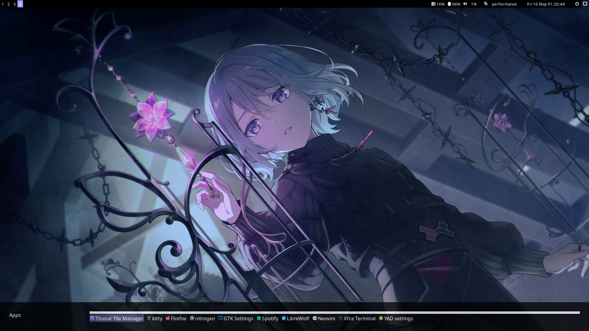
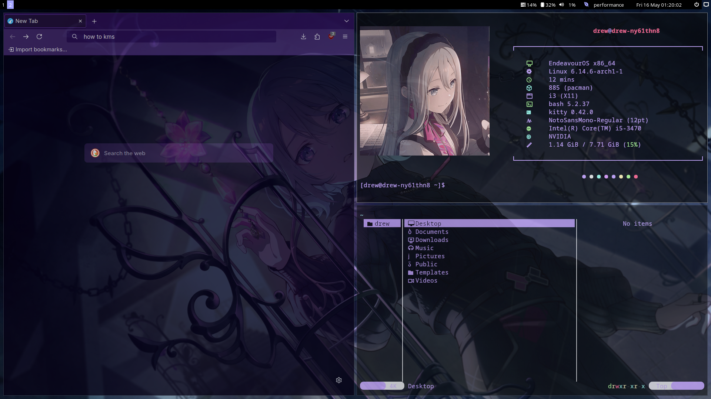
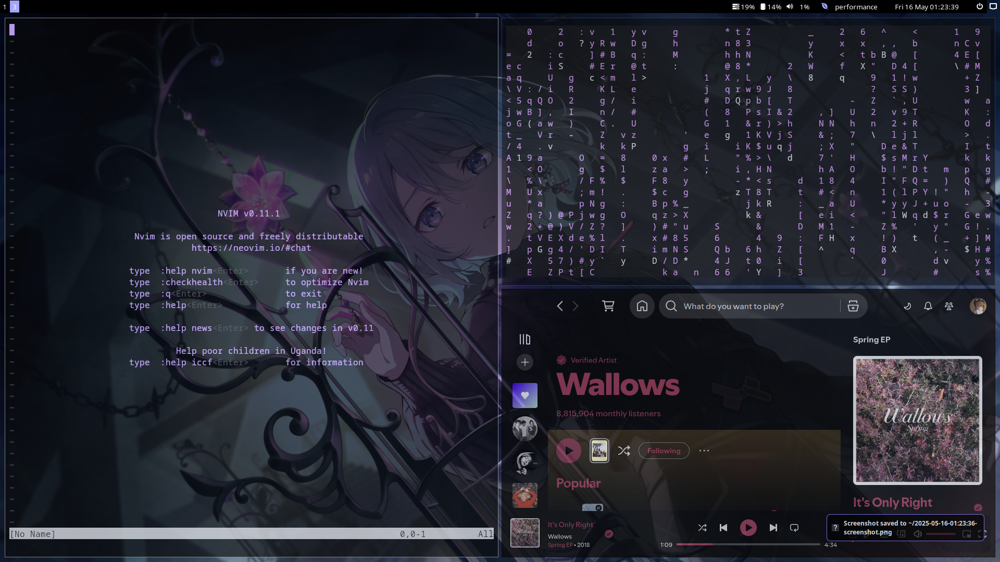

# A simple setup for i3wm and some tools basesd on [Stock EndeavourOS config for i3](https://github.com/endeavouros-team/endeavouros-i3wm-setup).

Heyy! Welcome to my github page.
These are my dotfiles for i3. This is still a work in progress. I'm fairly new to both i3wm and GitHub, so if you spot something that can be improved or fixed, feel free to open an issue or suggest a change!

I'm using this on EndeavourOS, if it matters.
Note: My pc cannot handle blur so I'm using transparancy effects.

#### Dependencies

- [i3 WM](https://i3wm.org/) - For window manager
- [Picom FL-Labs fork](https://github.com/FT-Labs/picom) - For blur and transparency
- [Rofi](https://github.com/davatorium/rofi) - App launcher
- [i3blocks](https://github.com/vivien/i3blocks) - top bar
- [kitty](https://github.com/kovidgoyal/kitty) - For terminal
- [neovim](https://github.com/neovim/neovim) - text editor or ide
- [fastfetch](https://github.com/fastfetch-cli/fastfetch) - cli
- [scrot](https://github.com/resurrecting-open-source-projects/scrot) - ss tool
- [nwg-look](https://github.com/nwg-piotr/nwg-look) - theme setter
- **extra**: an edit of [Material-Black](https://www.gnome-look.org/p/1316887) GTK theme featuring lavender colors and transparency is included and I've used [Dracula](https://github.com/m4thewz/dracula-icons) icons. I've also included some cursor themes. I'm currently using [Afterglow cursors](https://github.com/yeyushengfan258/Afterglow-Cursors).

### Screenshots
Here are some screenshots of the uploaded dotfiles:

### Installation 

- **1. For an EndeavourOS i3 installation**
  Download and extract config folders to your home (overwrite if asked), `run yay -S picom fastfetch neovim kitty rofi scrot open nwg-look`, apply the Material-Black-Lavender-Aero GTK theme, then restart your session.

- **2. Other (for Arch-based distros)**
  Run `yay -S i3 picom fastfetch neovim kitty rofi scrot polkit-gnome nwg-look`, copy config files to your home (overwrite if asked), apply the GTK theme in nwg-look, then restart your session.

### Thank you 

